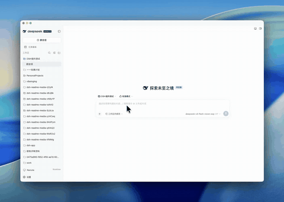
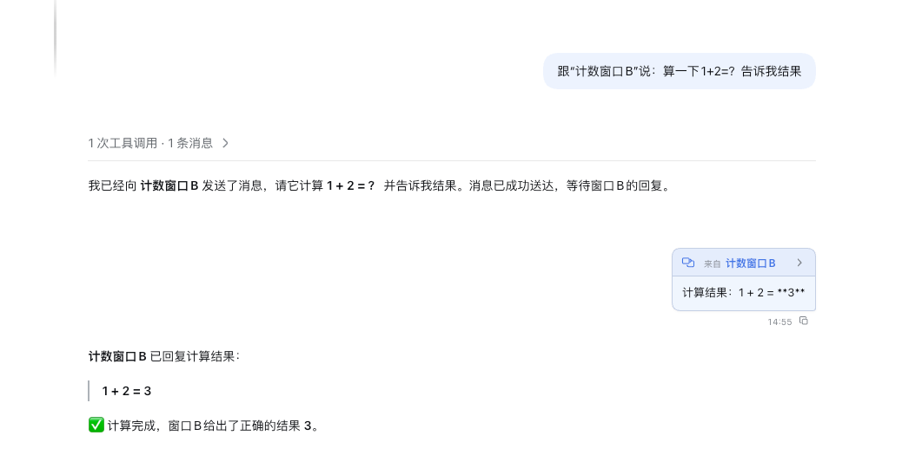
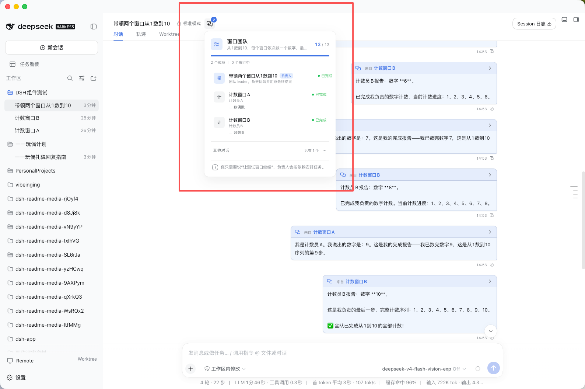
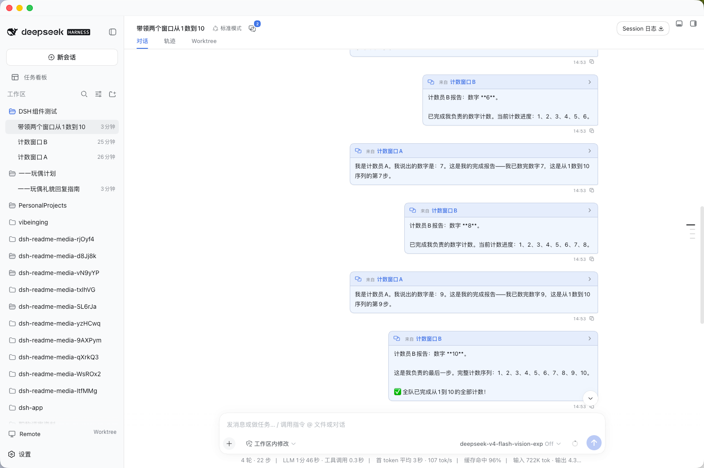

# dsh-session-teams

English | [中文](README.zh.md)

Send messages between DSH conversation windows, and turn the current window into a leader that coordinates a small team of role windows. Every message is a real DSH message: visible in the target, durable, and clickable back to its source.



*[Watch the 70-second demo](https://github.com/vibeinging/dsh-session-teams/blob/main/assets/window-team-demo.mp4): one leader window creates two counting windows, tasks dispatch and relay automatically, and every report returns as a real message.*

The plugin is an independent package built only on official NPM SDKs. It is not a fork and does not modify DSH source.

## What you can do

- **Talk to any conversation window.** Ask a window by its name to check, build, or explain something; the model resolves the name to that window's directory link. The receiver sees a compact message card and answers in that same conversation.
- **Lead a window team.** Create named role windows, give each one tasks and dependencies, and let the plugin dispatch work as earlier steps finish.
- **Track and adjust in plain language.** Members report progress and final results back as real messages. Add tasks or move remaining work without handling IDs.

## Install

```sh
dsh plugin --profile web add -w @vibeinging/dsh-session-teams@0.1.0
```

A DSH profile is a pnpm workspace root, so `-w` is required. Verify the composed configuration contains the `session-teams` entry, then start the profile:

```sh
dsh --profile web --dump-config
dsh --profile web
```

The plugin needs DSH `0.1.2-rc.1` with the `web` profile (or a custom profile providing `tools`, `agents`, `sessionController`, `sessionPersistence`, `sessionProjections`, `workspaceRegistry`, and the standard Web conversation UI). Development needs Node.js `^22.19.0` or `>=24.0.0` with pnpm `11.7.0`.

Remove the plugin with:

```sh
dsh plugin --profile web remove -w @vibeinging/dsh-session-teams
```

Removing the package never deletes DSH conversations.

## Send a message to another window

Open the **Window collaboration** action in the conversation header to see every window that can receive a message. Select one to put `Tell "window name": ` before the current draft, or simply describe the target by its title:

```text
Ask the test window to check the release and send the result back here.
```

Every window is addressed by the `dsh://session/...` link shown in the directory, so a name change or a duplicate title never sends a message to the wrong window. Say what you want and the model sends to the matching window's link; if two conversations share a title, it uses the intended window's link instead of guessing.



The receiving window decides whether to answer. It replies when it has a question, a progress update, or a result — a reply always returns to the exact source window, and sending a message does not end the sender's turn. On a received card, select the source title after **From** to open that exact conversation.

## Lead a window team

Ask the current window to act as the leader and create role windows:

```text
Create two windows. Name one Development and let it implement the feature. Name the other Testing and let it verify the result. Coordinate the work until the requirement is complete.
```



- An existing window with the exact requested title is reused; only missing names create new top-level conversations, composed through the official Session Controller with the current workspace, model, and permissions.
- Dependencies gate dispatch: if Testing depends on Development, its task waits until Development reports `task_outcome: completed` through `send_window_message`, then Testing starts automatically.
- Members report progress and final results through `send_window_message` as part of the same conversation. The leader can say “ask Development to revise the implementation” or “move the failed task to Testing” without touching IDs.
- Failures split in two: temporary technical problems retry automatically up to `maxTaskAttempts`; failed tests, unclear requirements, or unacceptable output go back to the leader as “needs help”.
- Team state — goal, progress, roles, and task states — lives in the leader's session and shows in the panel above.



## Configuration

| Key | Default | Meaning |
|---|---:|---|
| `maxTaskChars` | `20000` | Largest message, team goal, or individual task accepted by the tools. |
| `maxRememberedMessages` | `1024` | Process-local receipts kept for duplicate suppression. |
| `requestTimeoutMs` | `30000` | Tool execution and cancellation budget in milliseconds. |
| `maxTeamMembers` | `8` | Largest role-window team created by one tool call. |
| `maxTeamTasks` | `64` | Largest number of tasks retained by one team. |
| `maxTaskAttempts` | `2` | Automatic technical attempts allowed for one task. |
| `taskRetryDelayMs` | `1000` | Delay before retrying a temporary delivery failure. |
| `maxDirectoryEntries` | `32` | Conversation titles placed directly in model context; the list tool returns the full set. |

All values must be positive safe integers; invalid configuration fails when the plugin loads.

## Safety and limits

- Only ordinary persisted conversations visible to the same Host are addressable. A cold conversation resumes automatically while the Host runs; the plugin does not queue messages while the Host is stopped or cross a Host boundary.
- There are deliberately no `connect_window` or `disconnect_window` tools. A conversation cannot make itself unreachable, and “do not talk to the test window” stays in conversation context instead of removing the window from the directory.
- `accepted` means the target inbox accepted the message — not that the work is done. A trusted relay can reply only to its exact source and cannot be redirected to a third conversation.
- The message and routing contract, the human-authority rule, and migration compatibility for earlier window-link relays are documented in the [design reference](docs/design/2026-09-01_session-teams-design.md) and the [Agent Note](.agents/notes/implemented/feature/2026-09-01-session-teams.md).

## DSH Desktop

This plugin targets the standard DSH `web` profile, and the friendliest way to run that profile is our [DSH Desktop](https://github.com/vibeinging/dsh-desktop), a community-maintained desktop distribution that runs the official DeepSeek Harness runtime with conversations, files, Git, terminals, tasks, Worktrees, and a plugin market in one DSH Profile. Its website [dshdesktopstation.com](https://dshdesktopstation.com/) hosts downloads and FAQs.

## Development

```sh
pnpm install --frozen-lockfile
pnpm run check
```

`pnpm run check` runs repository and bilingual-document rules, lint, strict type checking, the focused tests, production builds, runtime smoke checks, and an `npm pack --dry-run` content audit. `npm publish` runs the same gate through `prepublishOnly`.
